**摘要：** 本项目基于OpenCV库，识别过程包括：图像灰度变换、高斯滤波、边缘检测、ROI（Region of Interest，感兴趣区域）选择、霍夫变换以及车道线绘制，实现了基于已有数据图片的道路车道线检测，基本能实现较为准确的车道线识别与绘制。

# 一、 **参考说明**

本项目参考了CSDN原创作者阿_旭的开源代码：[【保姆级教程】基于OpenCV实现实时道路车道检测【附完整源码】]()https://blog.csdn.net/qq_42589613/article/details/142173526

# 二、 **识别效果**

本项目基于原作者的开源代码进行调试优化，初次测试时无结果，如图1所示，因为ROI（Region of Interest，感兴趣区域）的选择未基于课程所提供实际图片进行调整，而造成进行霍夫变换时未识别到直线而报错；

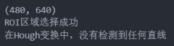

图1 初次测试结果

后经过调整ROI选取后，识别结果如图2所示，但是车道线识别结果较差，并且将阴影、横向停车线等均识别为了车道线，或者影响了车道线的判断。

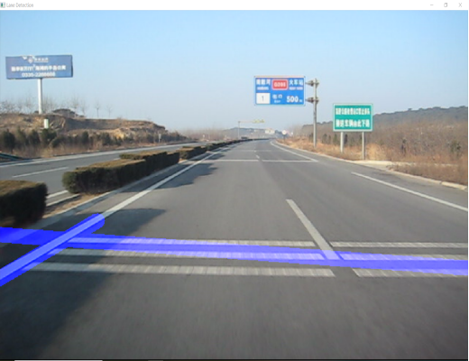

图2 初次车道线识别结果示例

最后参数调整与筛选（详见四、调参过程），得到较好的结果，识别结果基本贴合实际车道线，如图3所示，完整结果可见 **附件中output.gif与result_images/...** 。

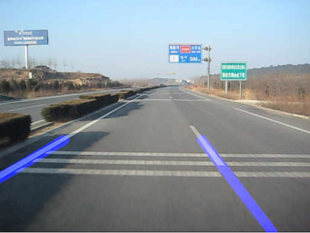

图3 最终车道线识别结果实例

# 三、 **识别过程分析**

## **3**.1 **整体识别过程综述**

    整体识别过程包括：图像灰度变换、高斯滤波、边缘检测、ROI（Region of Interest，感兴趣区域）选择、霍夫变换以及车道线绘制。

## **3**.2 **灰度变换**

原图片是BGR格式，将BGR格式转换为灰度是因为处理单通道图像比处理三通道彩色图像更快，并且也更适合提取车道线。由于OpenCV库已经将BGR格式转化灰度格式的处理进行封装打包，因此直接调用OpenCV库中的函数cvtColor，设置参数为cv2.COLOR_BGR2GRAY。

```
# 转换为灰度图像  
gray = cv2.cvtColor(image, cv2.COLOR_BGR2GRAY)
```

以MVI_1717_004.BMP为例，其原图如图4所示，经过灰度变换后如图5所示。

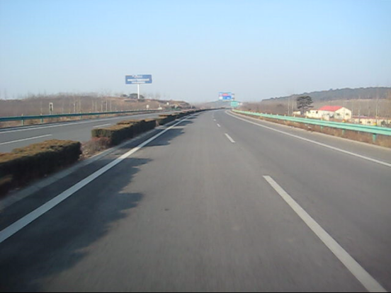

图4 MVI_1717_004.BMP原图

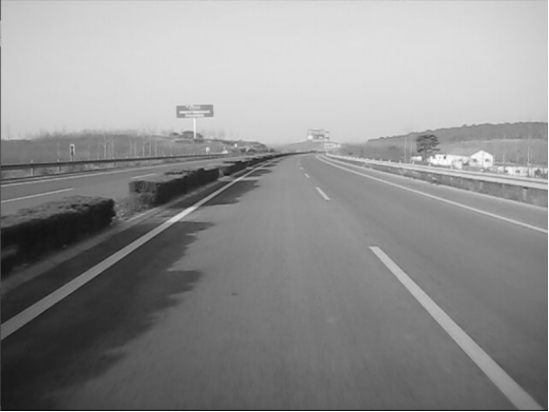

图5 MVI_1717_004.BMP灰度图

## **3.3 ****高斯****模糊**

图像中噪音会产生假边缘，因此在进一步处理之前，必须进行图像平滑处理。高斯模糊用于执行此过程。

高斯模糊是一种典型的图像过滤技术，用于降低噪音和增强图像特性，它用正态分布计算图像中每个像素的变换。权重是使用高斯分布选择的，每个像素都会受到考虑其周围像素的加权平均值的影响。通过减少高频元素并提高整体图像质量，这种模糊技术可以创建更柔和、更视觉上令人愉悦的图像。 

在OpenCV中，**cv2.GaussianBlur()** 函数用于对图像进行高斯模糊处理，通常用于去噪或图像平滑。它的函数原型如下：

`cv2.GaussianBlur(src, ksize, sigmaX[, dst[, sigmaY[, borderType]]])`

其中，src为输入的图像可以是灰度图（gray）或者彩色图（BGR），在这里直接将此前所获得的灰度图gray传入；ksize为元组（width,height）表示高斯核的大小，必须是奇数且大于0，在这里可以设置为（5,5）；sigmaX为浮点数表示高斯核在X方向上的标准差，用于控制模糊的强度，当设置为0时，函数会根据ksize自动计算适合的标准差，为了简便，这里将sigmaX设置为0。综上，进行高斯模糊操作时，代码参考如下：

```
# 高斯模糊处理  
kernel_size = 5  
blur = cv2.GaussianBlur(gray, (kernel_size, kernel_size), 0)
```

以MVI_1717_004.BMP为例，经过高斯模糊后如图6所示。

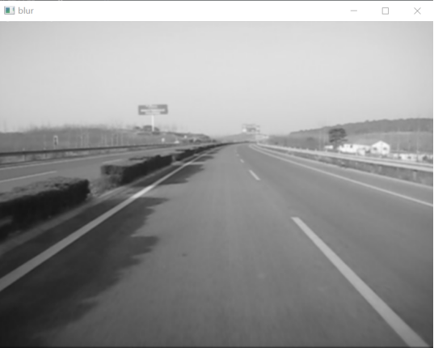

图6 MVI_1717_004.BMP高斯模糊图

## **3**.4 **边缘检测**

OpenCV同样封装好了边缘检测函数，如Canny 边缘检测器，它计算模糊图像各个方向的梯度，并追踪强度变化较大的边缘。它的函数原型如下：

`cv2.Canny(image, threshold1, threshold2[, edges[, apertureSize[, L2gradient]]])`

其中，image为输入的图像，通常为单通道灰度图，在这里直接将前一步中所得的经高斯模糊处理后的图像传入；threshold1与threshold2均为浮点数，分别表示边缘检测中的两个阈值，图像中像素梯度强度小于threshold1的地方将被认为不是边缘，像素梯度强度大于threshold2的地方将被认为是边缘，像素梯度介于 threshold1 和 threshold2的地方，只有在与强边缘相连时才会被保留。综上，进行边缘检测时，代码如下，

```
# 边缘检测  
low_threshold = 50  
high_threshold = 150  
edges = cv2.Canny(blur, low_threshold, high_threshol
```

以MVI_1717_004.BMP为例，经过边缘检测后如图7所示。

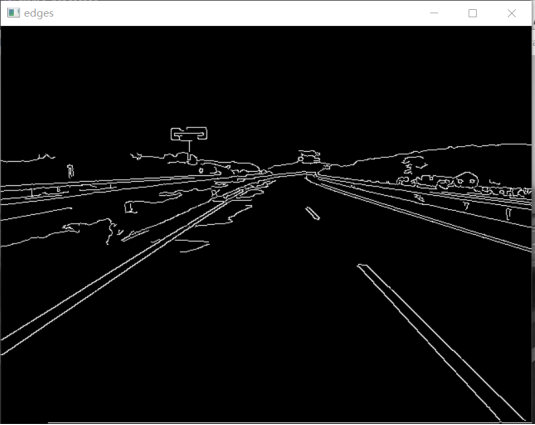

图7 MVI_1717_004.BMP 边缘检测图

## **3.** **4** **ROI选择（感兴趣区域选择）**

由图7可以看到，识别到的区域范围很广而且有很多干扰项，而实际车道线有关的区域没有那么大，因此可以仅考虑车道覆盖的区域，即选择感兴趣区域（ROI，Region of Interest）。可以创建一个蒙版，其尺寸与我们的道路图像相同。此外，在我们的 Canny 图像的每个像素和此蒙版之间执行按位 AND 运算。它最终遮盖 Canny 图像并显示蒙版多边形轮廓所描绘的感兴趣区域。

经过多次尝试，最终确定蒙版（mask）的区域范围为：

```
rows, cols = edges.shape[:2]  
#修改调试ROI区域的四个顶点  
bottom_left = [cols * 0, rows * 0.8]  
top_left = [cols * 0.4, rows * 0.4]  
bottom_right = [cols * 0.9, rows * 0.9]  
top_right = [cols * 0.6, rows * 0.4]
vertices = np.array([[bottom_left, top_left, top_right, bottom_right]],  dtype =np.int32)
```

接下来通过OpenCV的相关函数，利用cv2.fillPoly函数对蒙版区域进行填充，并且用cv2.bitwise_and函数实现蒙版与原图像执行按位AND运算，代码如下：

```
# 填充ROI区域  
cv2.fillPoly(mask, vertices, ignore_mask_color)  
# 返回ROI区域  
masked_edges = cv2.bitwise_and(edges, mask)
```

最终返回ROI选区。

以MVI_1717_004.BMP为例，经过ROI选择后如图8所示。

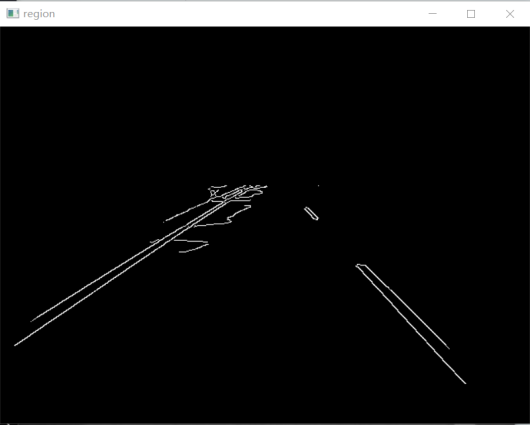

图8 MVI_1717_004.BMP ROI选择图

## **3**  **.** **5** **概率霍夫变换与车道线绘制**

在图像处理中，霍夫变换是一种特征提取方法，用于查找线和圆等基本几何对象。通过将图片空间转换为参数空间，可以通过累积投票点来识别形状。经典的霍夫变换通常用于检测图片中的直线，因此其可用于检测车道线。

而霍夫变换扩展为概率霍夫变换来可以解决计算复杂性。为了加快处理速度同时保持形状检测的准确性，它会随机选择一组图片点并仅对这些点应用霍夫变换。

OpenCV中已经将概率霍夫变换函数打包，与传统霍夫变换相比，它更加高效，能够返回图像中检测到的直线的起点和终点坐标，其函数原型为：

`cv2.HoughLinesP(image, rho, theta, threshold,  `

其中，image为输入的单通道图像；rho为累加器的距离分辨率，单位为像素，控制检测到的直线的精度，值越小，精度越高，但计算开销也越大，通常设置为1；theta为累加器的角度分辨率，单位为弧度，用于控制检测直线角度的精度，通常设置为np.pi / 180（即每次递增 1°）；threshold为累加器中的阈值，表示一条直线需要的最小票数（即检测点数），值越大，检测到的直线越少但更可靠；值越小，会检测到更多的直线，但可能包含噪声；minLineLength和maxLineGap分别为直线的最小长度和同一条直线中两点之间的最大允许间隔，小于minLineLength的直线会被忽略，点间距大于maxLineGap的两点会认为是属于2条不同直线；返回值为记录直线端点坐标四元组(x1,y1,x2,y2)的数据集。

综上，进行边缘检测时，代码如下，

```
# 定义霍夫变换的参数  
rho = 1  
theta = np.pi / 180  
threshold = 50 #增加阈值以减少干扰  
min_line_length = 20  
max_line_gap = 500  
# 使用霍夫变换检测直线  
lines = cv2.HoughLinesP(region, rho = rho, theta = theta, threshold = threshold, minLineLength = min_line_length, maxLineGap = max_line_gap)
```

以MVI_1717_004.BMP为例，最终车道线绘制如图9所示。

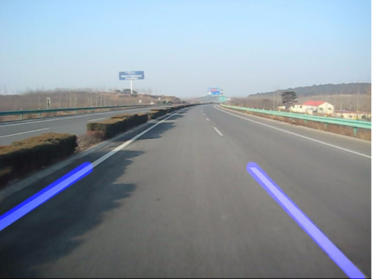

图9 MVI_1717_004.BMP ROI车道线绘制图

# 四、 **调参过程**

首先是对ROI区域的调整。若把图像宽记为w，高记为h，则初始蒙版区域四顶点为：（0.1w，0.95h）、（0.4w，0.6h）、（0.9w，0.95h）、（0.6w，0.6h），如图10所示。结果发现该区域内无法通过概率霍夫变换提取出直线，绘制图像发现区域过于集中于车道内，因此大概率将车道线所在区域刨除了。

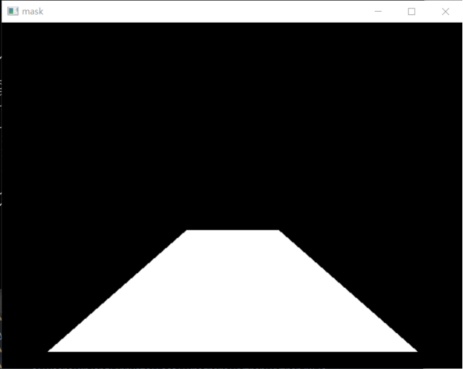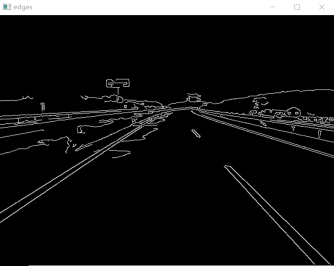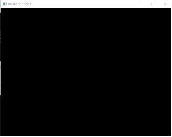

图10 初步mask区域与边缘区域对比

于是将四个顶点往外移动，多次尝试后，确定了最终蒙版区域四顶点为（0w，0.8h）、（0.4w，0.6h）、（0.9w，0.95h）、（0.6w，0.6h），如图11所示。

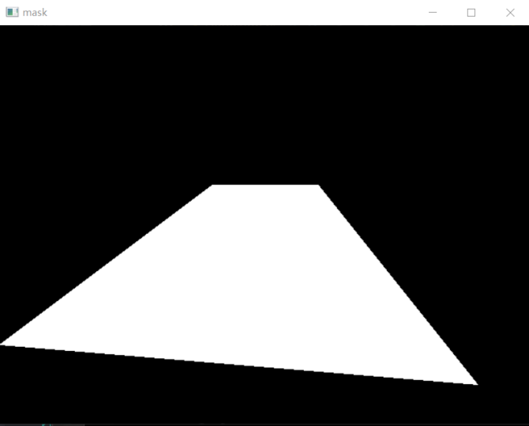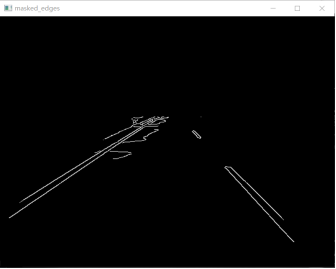

图11 最终mask区域与边缘区域对比

此外还有对概率霍夫变换提取直线时的筛选调试。初步调试的时候发现，由于干扰项较多，比如停车线、阴影的影响，导致误判，如图12、图13所示。


图12 MVI_1717_265.BMP误判车道线

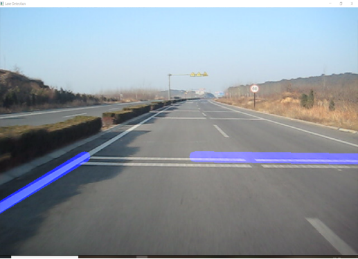

图13 MVI_1717_382.BMP误判车道线

解决方法之一是，在概率霍夫变换提取直线的时候，增加对直线斜率的筛选，如斜率绝对值小于0.2的直线不被认为是车道线，代码如下：

```
# 修改斜率的阈值  
if abs(slope) < 0.2:  
    continue
```

同时，再对概率霍夫变换的阈值进行一些调整，如适当的缩放，经过一些尝试后，确定概率霍夫变换的参数如3.5中所示，得到的结果较好，如图14、图15所示。


图14 MVI_1717_265.BMP最终车道线识别结果

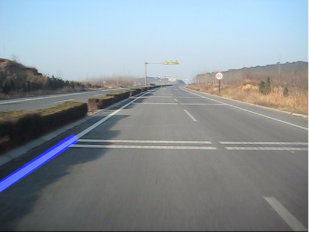

图15 MVI_1717_265.BMP最终车道线识别结果

# 五、 **附录**

本项目已将所有输出图片存入目录文件夹 `./result_images/`（避免中文路径报错），原始图片存于 `./images`。

生成的gif图像已存为`./output.gif`。

代码文件包括`main.py`，`Detection.py`，DrawLaneLine.py以及main.ipynb。其中`main.ipynb`为调试代码包含完整的主函数与所用到的相关函数可单独运行；`main.py`为最终代码文件直接运行即可；`Detection.py`，`DrawLaneLine.py`为`main.py`所用的函数文件，需与`main.py`文件放于统一文件夹内。

代码所依赖的库文件已存入`requirement.txt`中。
